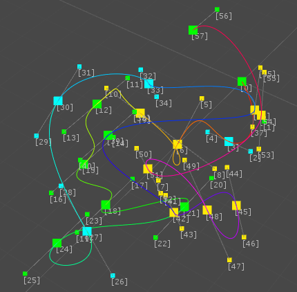
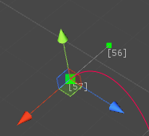
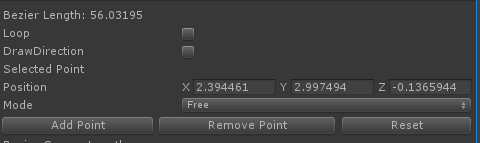
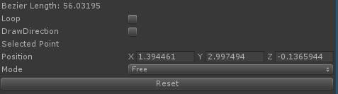

# UnityBezierTools

3D Bezier Curve Library for Unity3d.  
Loop on/off support.

## Usage

import [UnityBezierTools.unitypackage](UnityBezierTools.unitypackage) to your unity project.

### How to create Bezier scriptable object

1. [Menu]->[Assets]->[Create]->[Bezier]
2. Select to large control point. it move position by D&D.   
  
In inspector window,  
 - click [Add Point] Button, add to control point.  
 - click [Remove Point] Button, remove selected large control point.  
 - click [Reset] Button, reset selected bezier object.

 

3. Select to small control point. it move position by D&D.  
 In inspector window,
  - click [Reset] Button, reset selected bezier object.

  

4. Other inspector window settings,
 - [Mode] pull-down menu, change connect mode in control point.
 - [Loop] toggle,  connect the first and last points on enable.
 - [DrawDirection] toggle, Draw curve direction line on enable .
